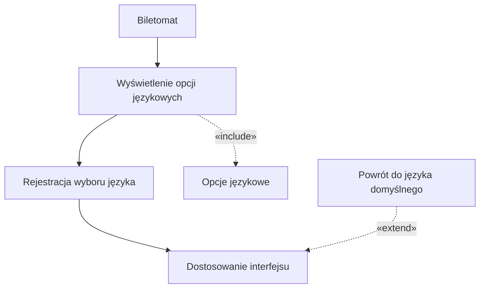
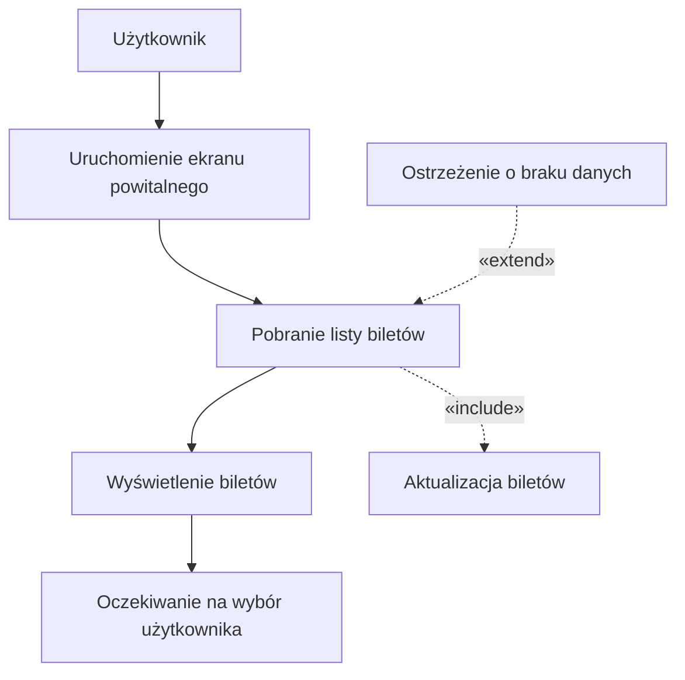
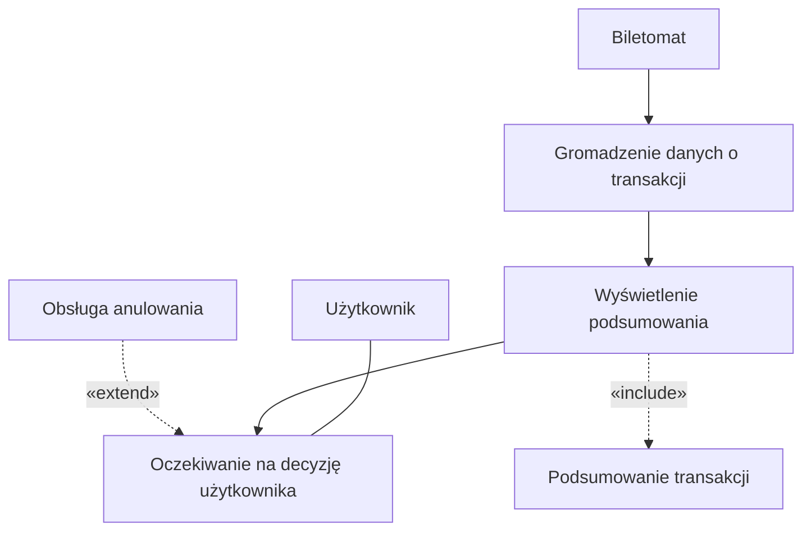
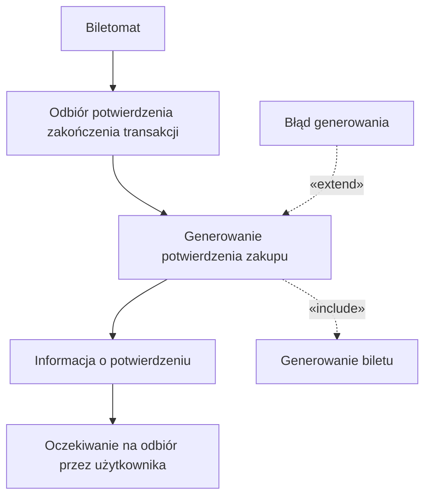
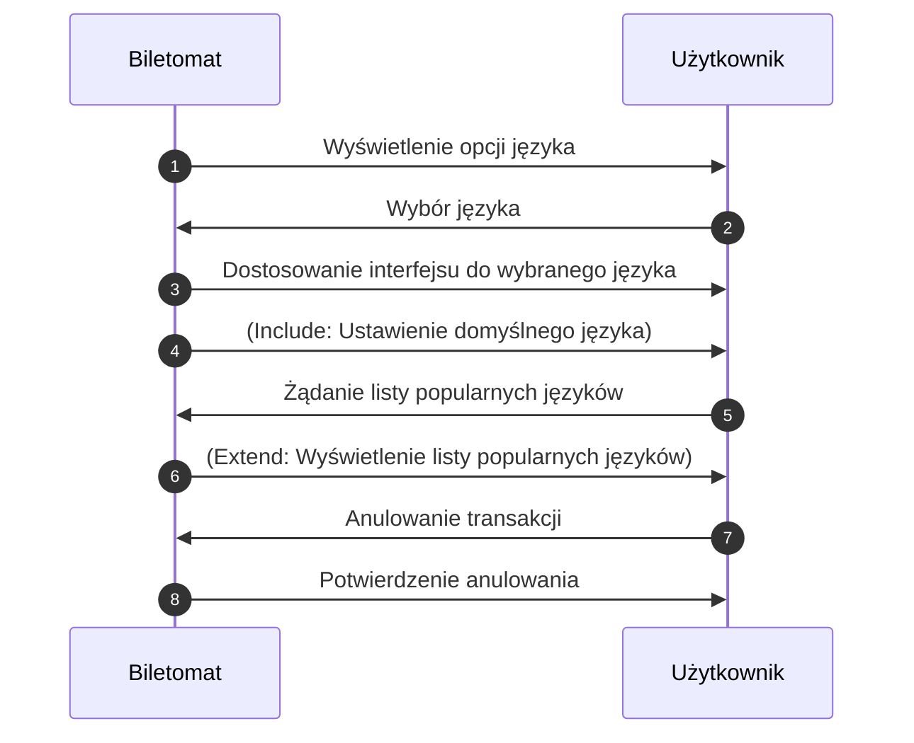
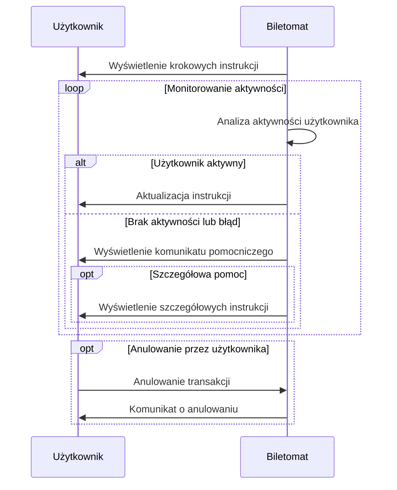

## Historie
1. Jako biletomat, chcę automatycznie aktualizować listę dostępnych biletów i ich
cen, aby zapewnić zgodność z polityką przewoźnika.
2. Jako biletomat, chcę rejestrować wszystkie transakcje i wysyłać raporty do
systemu centralnego, aby umożliwić monitoring i kontrolę operacji.
3. Jako biletomat, chcę posiadać czytelny ekran dotykowy, aby użytkownik mógł
łatwo nawigować po interfejsie.
4. Jako biletomat, chcę być wyposażony w różne metody płatności (terminal kart,
czytnik gotówki, NFC), aby obsługiwać różnorodne transakcje.
5. Jako biletomat, chcę wydawać resztę w gotówce, jeśli użytkownik zapłaci
nadmiarowo, aby transakcja była zgodna z oczekiwaniami.

## Diagramy przypadków użycia 

### Obsługa wyboru języka

### Wyświetlenie dostępnych biletów

### Wyświetlenie podsumowania transakcji

### Generowanie potwierdzenia zakupu

## Diagramy sekwencyj
### Obsługa wyboru języka
#### Scenariusz Główny (Podstawowy)

Cel: Biletomat wyświetla dostępne opcje językowe, odbiera wybór użytkownika i dostosowuje interfejs do wybranego języka.

Kroki:

- Wyświetlenie opcji języka:
    - Biletomat po uruchomieniu interakcji automatycznie prezentuje użytkownikowi ekran z dostępnymi opcjami językowymi.
    - Ekran zawiera listę dostępnych języków, a także opcję ustawienia języka domyślnego (operacja include).

- Odbiór wyboru języka:
    - Biletomat oczekuje na wybór użytkownika.
    - Po otrzymaniu wyboru, system przetwarza tę informację i automatycznie dostosowuje interfejs do wybranego języka.

- Dostosowanie interfejsu:
    - Po ustaleniu wyboru, Biletomat wykonuje procedurę zmiany interfejsu użytkownika.
    - Jeżeli użytkownik nie dokonał aktywnego wyboru, system może automatycznie ustawić język domyślny (include).

- Zakończenie podstawowego przepływu:
    - Interfejs zostaje dostosowany do wybranego (lub domyślnego) języka, a użytkownik kontynuuje dalsze interakcje.

#### Scenariusz Alternatywny

Cel: Umożliwić użytkownikowi uzyskanie dodatkowej listy popularnych języków oraz umożliwić anulowanie procesu wyboru języka.

Kroki:

- Rozszerzenie opcji wyboru języka:
    - Po wysłaniu przez Biletomat standardowej listy opcji językowych (krok 1 scenariusza głównego), użytkownik wysyła dodatkowe żądanie o wyświetlenie listy popularnych języków.
    - Biletomat, zgodnie z relacją extend, wykonuje operację wyświetlenia rozszerzonej listy popularnych języków.
    - Użytkownik przegląda rozszerzoną listę i dokonuje wyboru jednego z dostępnych języków, co skutkuje powrotem do głównego przepływu (krok 2 i 3 scenariusza głównego).

- Anulowanie procesu:
    - W dowolnym momencie interakcji (zarówno w głównym przepływie, jak i w alternatywnym scenariuszu) użytkownik może zdecydować o anulowaniu transakcji.
    - Po otrzymaniu sygnału anulowania, Biletomat przerywa proces wyboru języka i wysyła potwierdzenie anulowania.
    - Proces zostaje zakończony – system może powrócić do ekranu powitalnego lub zakończyć bieżącą sesję interakcji.
    

### Wyświetlanie instrukcji

#### AKTOR: Biletomat.
#### OBIEKTY: Użytkownik.
#### SCENARUISZ GŁOWNY:
	•	Biletomat wyświetla krokowe instrukcje użytkownikowi na ekranie.
	•	Biletomat monitoruje aktywność użytkownika.
#### SCENARIUSZ ALTERNATYWNY 1 (Brak aktywności lub błąd):
	•	Biletomat wykrywa brak aktywności użytkownika.
	•	Wyświetla komunikat pomocniczy, informujący o konieczności podjęcia działań.
	•	Jeśli problem się utrzymuje, biletomat oferuje szczegółową pomoc w formie dodatkowych instrukcji.

#### SCENARIUSZ ALTERNATYWNY 2 (Anulowanie transakcji):
	•	Użytkownik wybiera opcję anulowania transakcji.
	•	Biletomat wyświetla potwierdzenie anulowania i kończy operację.

