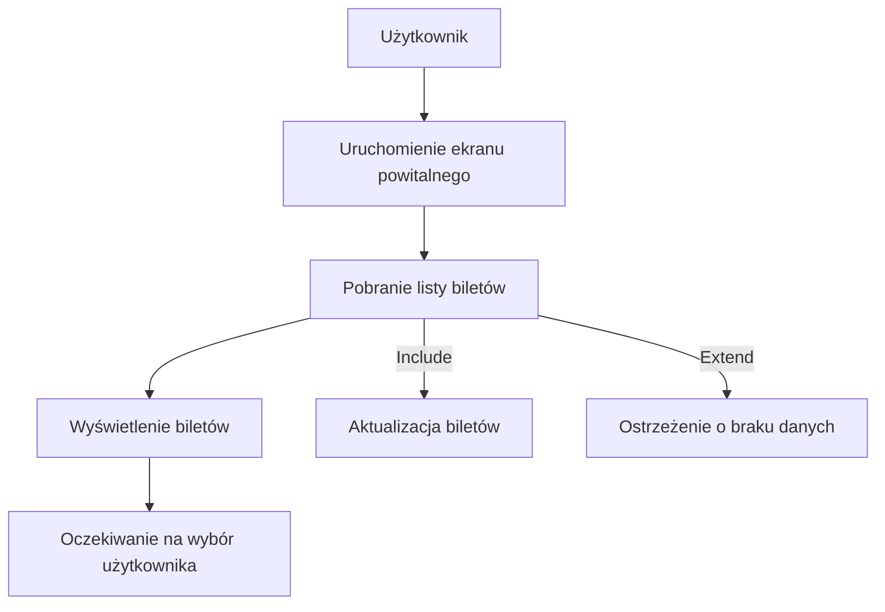
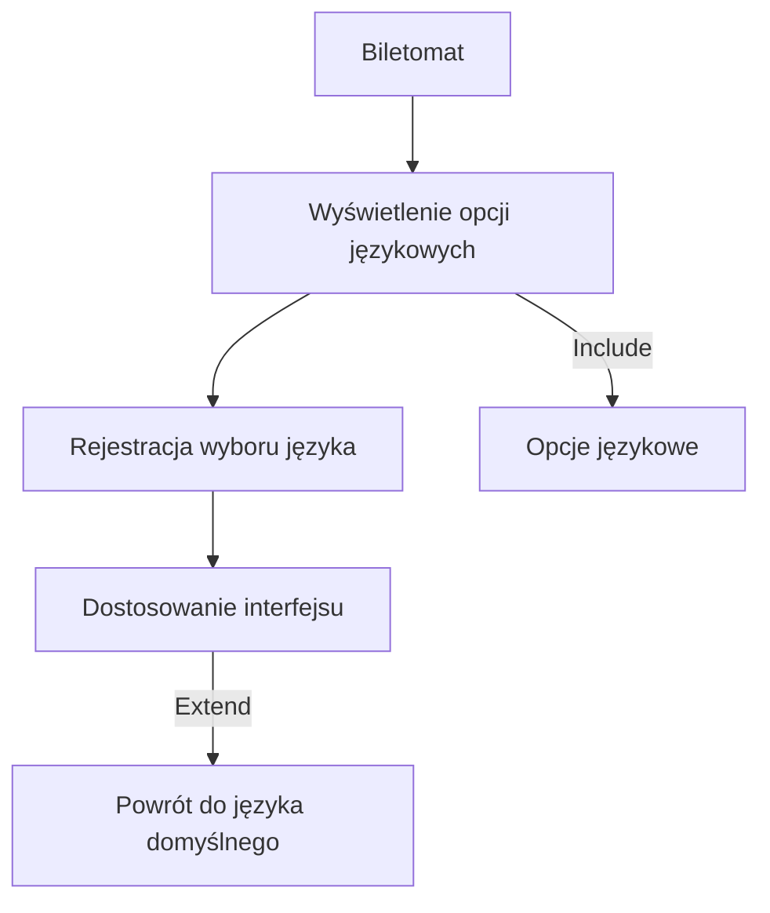
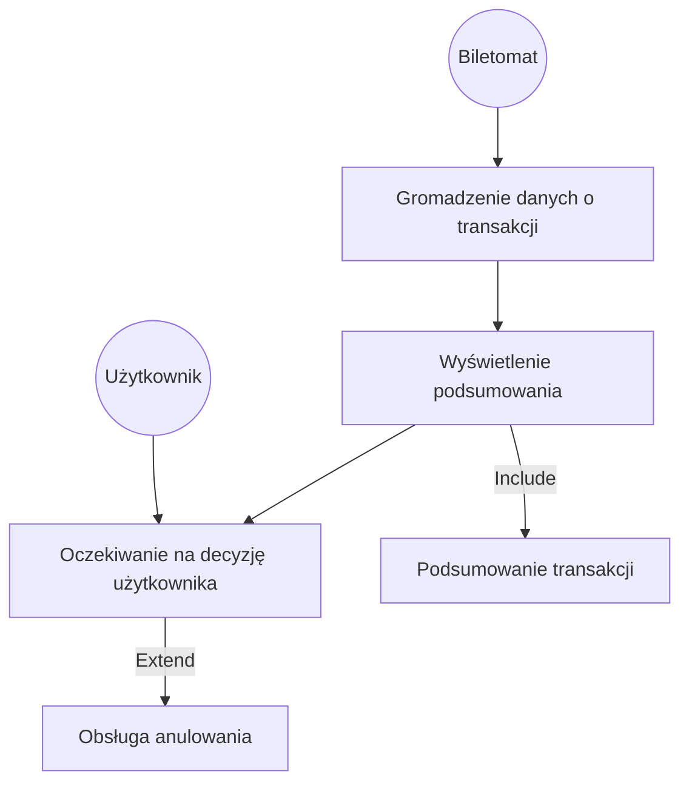
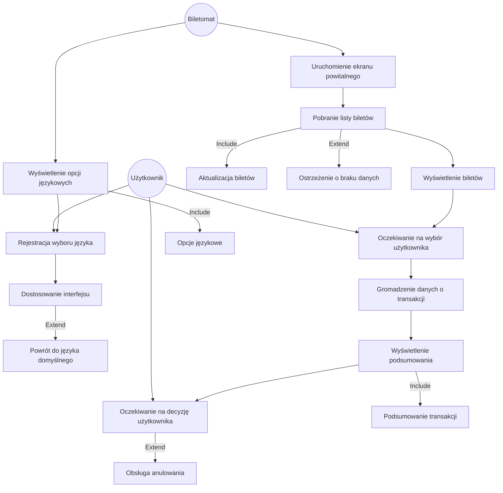

## Historie
1. Jako biletomat, chcę automatycznie aktualizować listę dostępnych biletów i ich
cen, aby zapewnić zgodność z polityką przewoźnika.
2. Jako biletomat, chcę rejestrować wszystkie transakcje i wysyłać raporty do
systemu centralnego, aby umożliwić monitoring i kontrolę operacji.
3. Jako biletomat, chcę posiadać czytelny ekran dotykowy, aby użytkownik mógł
łatwo nawigować po interfejsie.
4. Jako biletomat, chcę być wyposażony w różne metody płatności (terminal kart,
czytnik gotówki, NFC), aby obsługiwać różnorodne transakcje.
5. Jako biletomat, chcę wydawać resztę w gotówce, jeśli użytkownik zapłaci
nadmiarowo, aby transakcja była zgodna z oczekiwaniami.

## Diagramy przypadków użycia
### Wyświetlenie dostępnych biletów

### Obsługa wyboru języka

### Wyświetlenie podsumowania transakcji

### Wyświetlenie dostępnych biletów + Obsługa wyboru języka + Wyświetlenie podsumowania transakcji

