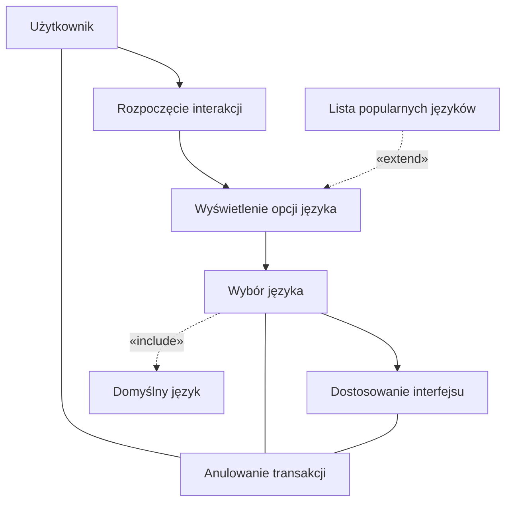
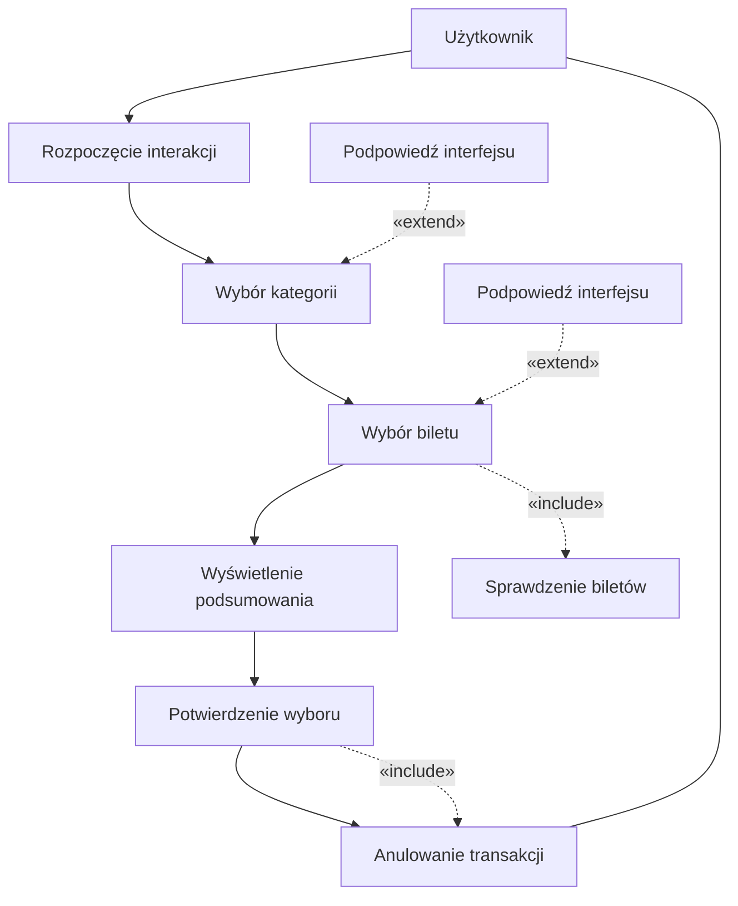
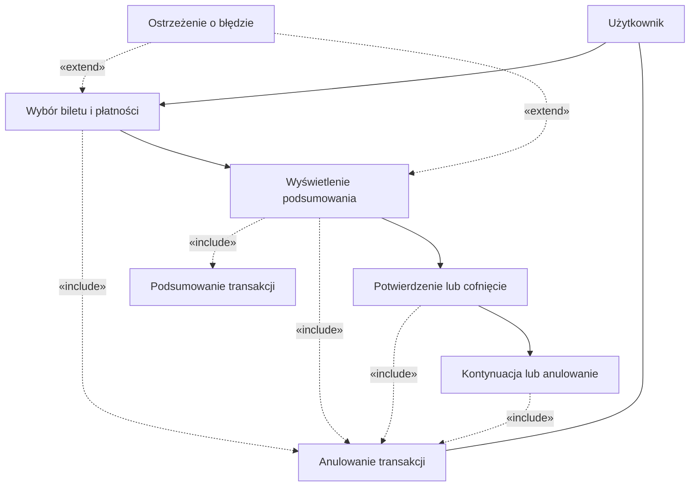

## Historie
1. Jako użytkownik, chcę szybko wybrać rodzaj biletu, aby zminimalizować czas
spędzony przy biletomacie.
2. Jako użytkownik, chcę mieć możliwość wyboru języka, aby móc korzystać z
biletomatu bez względu na znajomość języka lokalnego.
3. Jako użytkownik, chcę sprawdzić poprawność transakcji przed jej finalizacją,
aby uniknąć pomyłek.
4. Jako użytkownik, chcę otrzymać potwierdzenie zakupu (np. wydruk biletu lub
elektroniczny bilet), aby móc korzystać z transportu zgodnie z przepisami
5. Jako użytkownik, chcę płacić za bilet kartą, gotówką lub telefonem, aby mieć
większą elastyczność w wyborze metody płatności.
6. Jako użytkownik, chcę otrzymać wyraźne instrukcje na ekranie, aby wiedzieć,
jak dokonać zakupu krok po kroku.
7. Jako użytkownik, chcę widzieć czas pozostały na decyzję (np. wyświetlany
licznik czasu), aby móc szybko podjąć działanie.

## Diagramy przypadków użycia 
### Wybór języka



### Szybki wybór rodzaju biletu


### SPRAWDZENIE POPRAWNOŚCI TRANSAKCJI


### Otrzymanie potwierdzenia zakupu
```mermaid
flowchart TD
    U[Użytkownik]
    S[Biletomat]

    
    S --> A[Generowanie potwierdzenia]
    A --> B[Odebranie potwierdzenia]
    B --> C[Komunikat o zakończeniu]


    A -.->|«include»| GT[Generowanie biletu]
    B -.->|«include»| CANCEL[Anulowanie transakcji]

   
    WF[Wybór formy potwierdzenia]
    WF -.->|«extend»| A

    
    U --- CANCEL
 ```
### Otrzymanie potwierdzenia zakupu

#### AKTOR: Użytkownik
#### OBIEKTY: Biletomat
#### Scenariusz Główny (Podstawowy):
- Generowanie potwierdzenia
    - Po zakończeniu transakcji Biletomat przygotowuje potwierdzenie w formie biletu lub kodu elektronicznego.
    - Jest to operacja include: Generowanie biletu.
- (Extend) Wybór formy potwierdzenia:
    - Jeśli system przewiduje wybór między formą drukowaną a elektroniczną, Biletomat wyświetla odpowiednie opcje i czeka na decyzję użytkownika.
    - Zgodnie z relacją extend, uruchamiana jest procedura umożliwiająca wybór formy dostarczenia potwierdzenia (np. druk czy e-mail).

- Odebranie potwierdzenia:
    - Użytkownik odbiera wydruk biletu lub otrzymuje kod elektroniczny.
    - Biletomat sygnalizuje (np. komunikatem na ekranie), że potwierdzenie jest gotowe do odbioru bądź zostało wysłane.

- Komunikat o zakończeniu:
    - Po odbiorze potwierdzenia system wyświetla informację o pomyślnym zakończeniu transakcji.
    - Proces zostaje zakończony, a Biletomat może powrócić do ekranu głównego.
#### Scenariusz Alternatywny – Anulowanie transakcji (Include):
- Anulowanie transakcji
    - W dowolnym momencie, zanim dojdzie do finalizacji, użytkownik może zdecydować się przerwać operację.
    - Zgodnie z relacją include: Anulowanie transakcji, Biletomat wyświetla komunikat potwierdzający anulowanie, a proces zostaje zakończony.
    - W takiej sytuacji potwierdzenie nie jest generowane bądź zostaje unieważnione, a Biletomat powraca do ekranu powitalnego lub kończy bieżącą sesję.

```mermaid
sequenceDiagram
    autonumber
    participant U as Użytkownik
    participant BT as Biletomat

    %% Rozpoczęcie procesu po dokonanym zakupie
    note over BT: include: Generowanie biletu

    BT->>U: Informacja o generowaniu potwierdzenia

    alt (Extend) Wybór formy potwierdzenia
        BT->>U: Zapytanie o formę potwierdzenia (druk/elektroniczny)
        U->>BT: Wybór formy
        BT->>U: Potwierdzenie wybranej formy
    end

    %% Odebranie potwierdzenia
    BT-->>U: Gotowe potwierdzenie zakupu (druk / elektroniczne)
    BT->>U: Komunikat o zakończeniu procesu

    %% Scenariusz Alternatywny - Anulowanie transakcji
    opt include: Anulowanie transakcji
        U->>BT: Decyzja o przerwaniu (anulowanie)
        BT->>U: Komunikat o anulowaniu
        note over U,BT: Proces zostaje zakończony
    end

```

