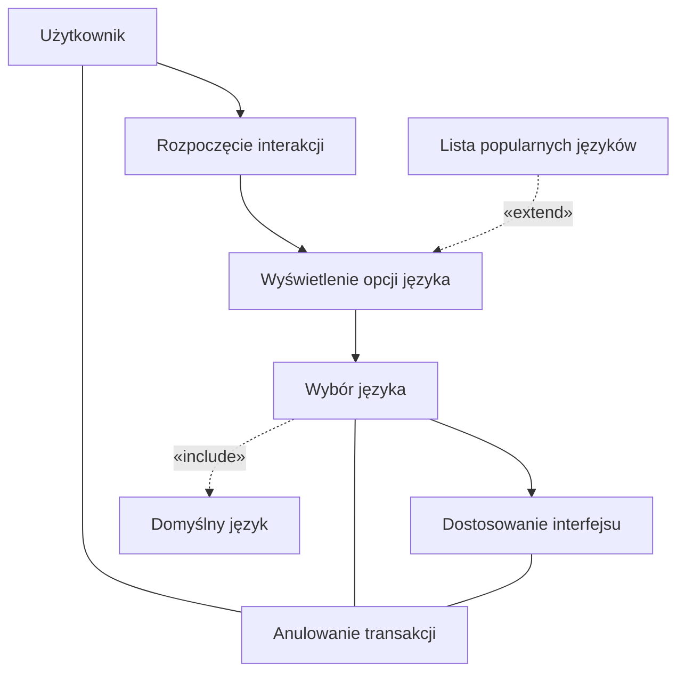
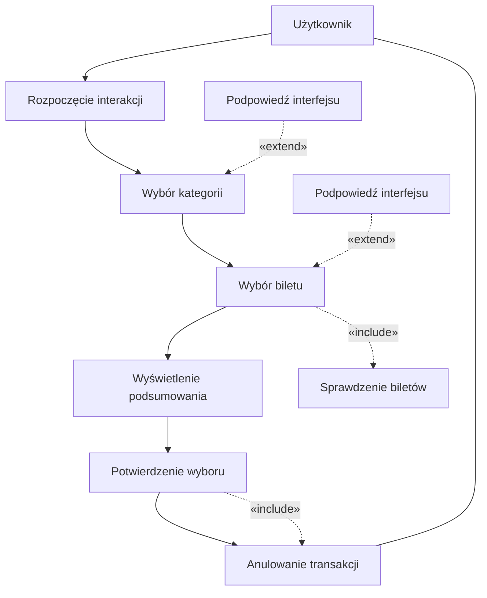
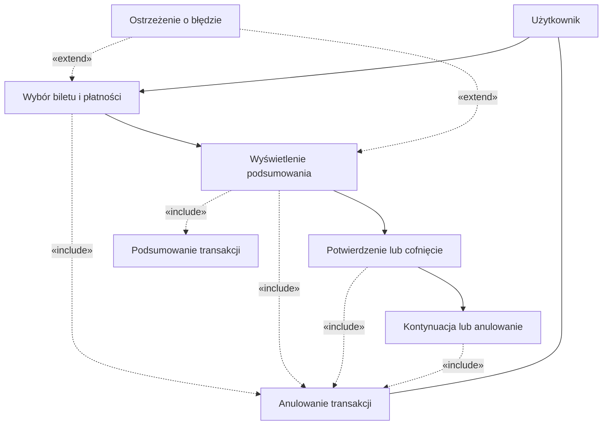
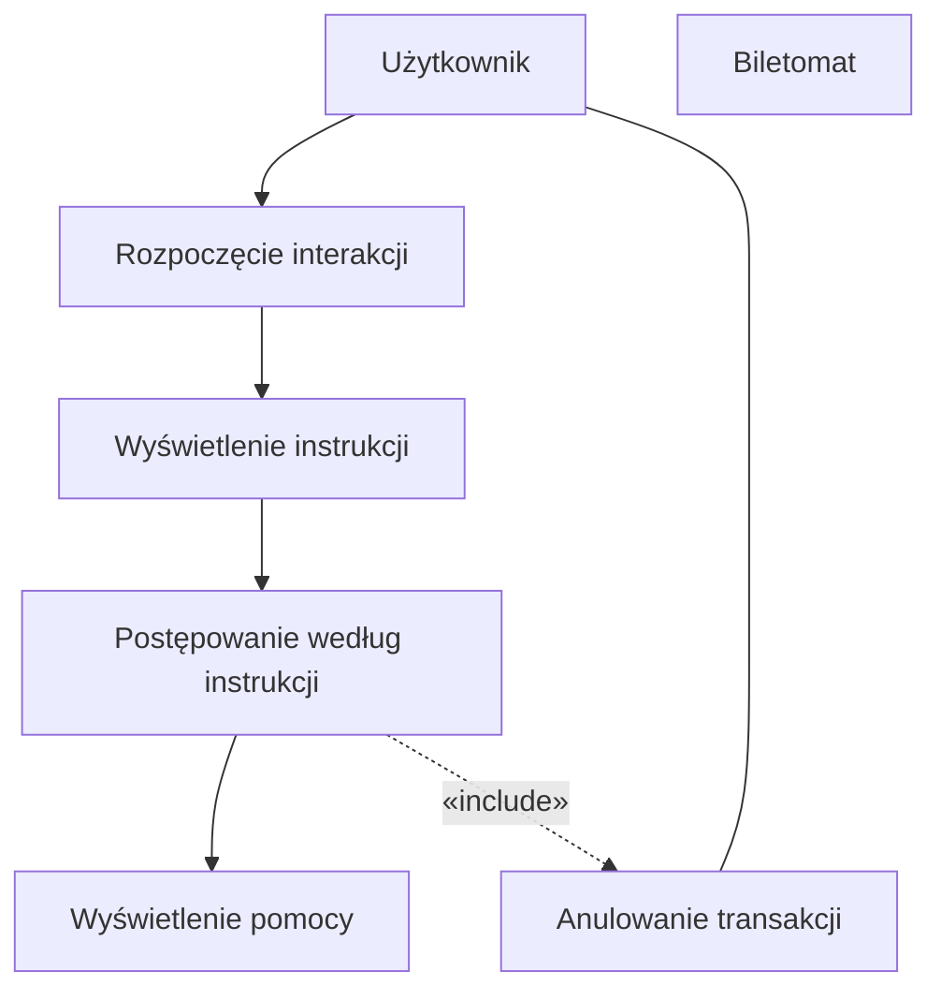
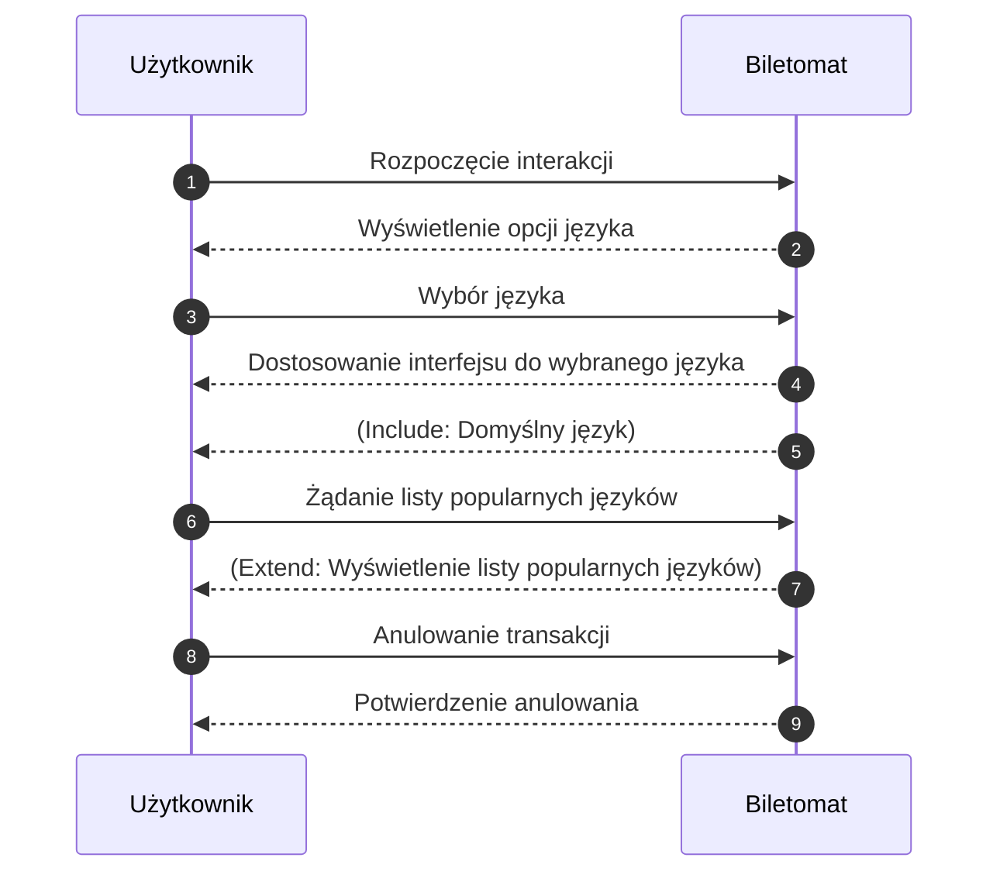
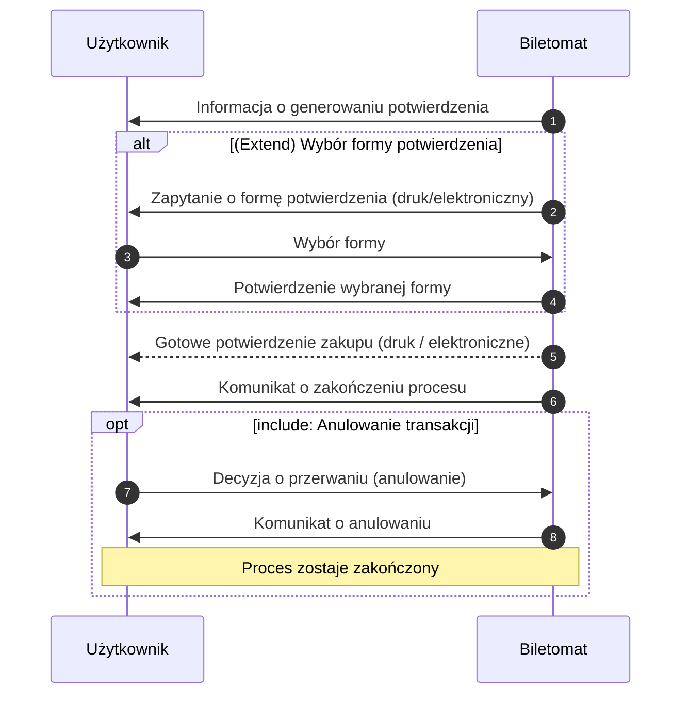
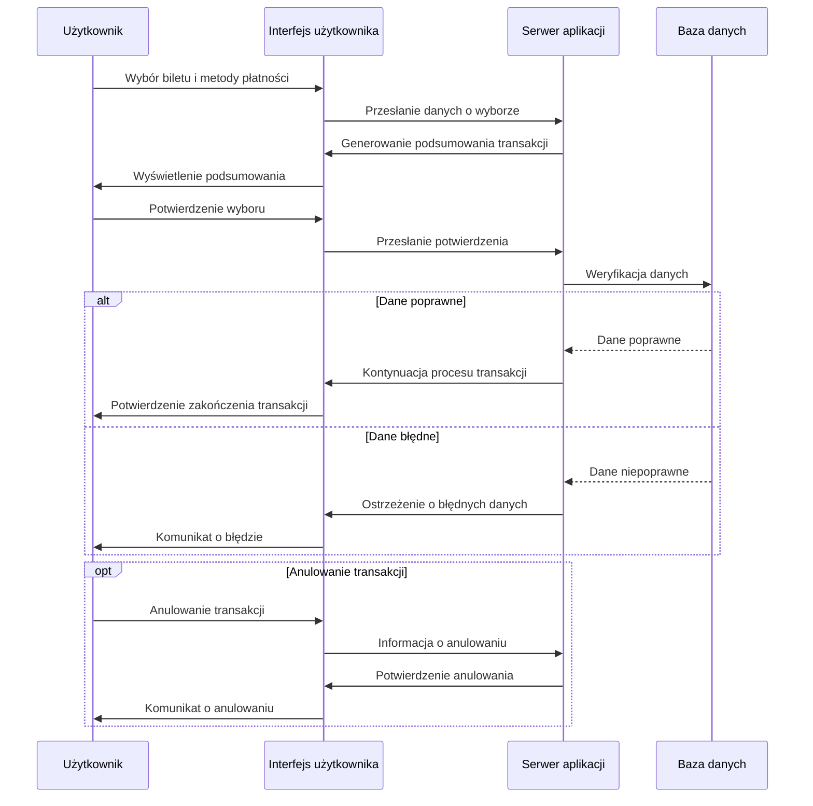
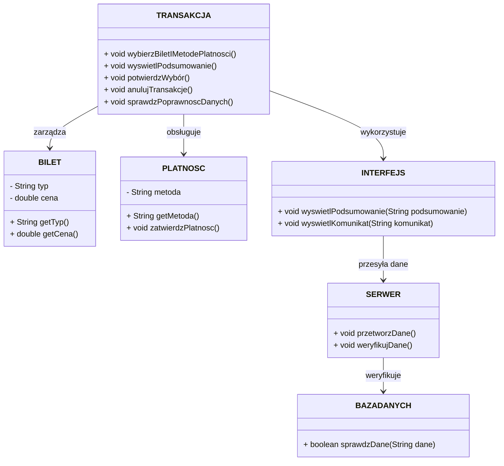
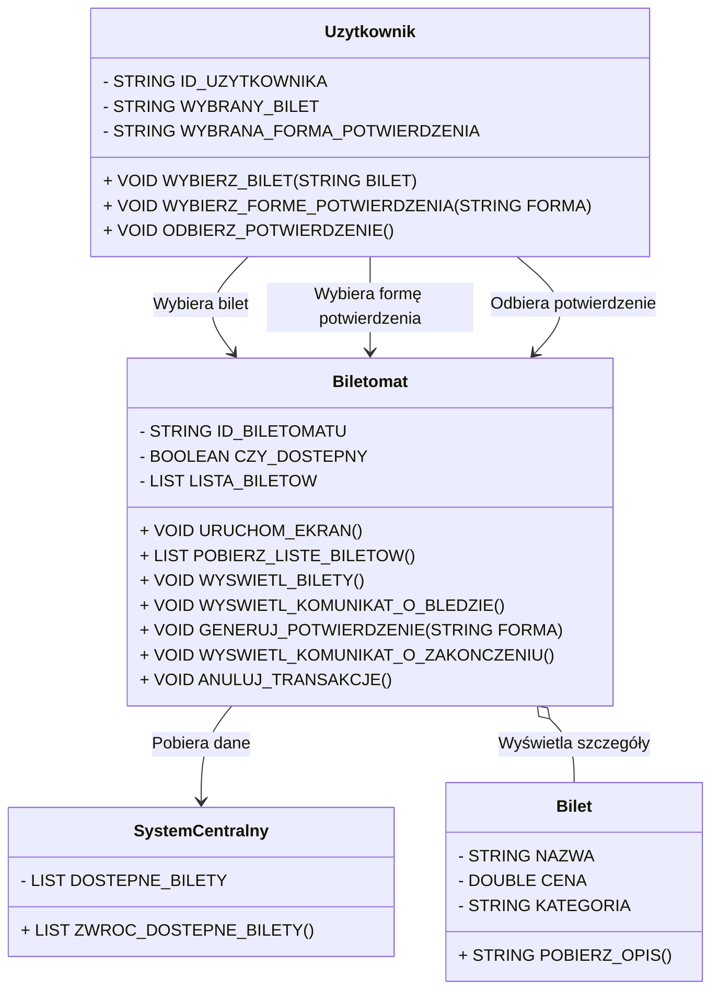

## Historie
1. Jako użytkownik, chcę szybko wybrać rodzaj biletu, aby zminimalizować czas
spędzony przy biletomacie.
2. Jako użytkownik, chcę mieć możliwość wyboru języka, aby móc korzystać z
biletomatu bez względu na znajomość języka lokalnego.
3. Jako użytkownik, chcę sprawdzić poprawność transakcji przed jej finalizacją,
aby uniknąć pomyłek.
4. Jako użytkownik, chcę otrzymać potwierdzenie zakupu (np. wydruk biletu lub
elektroniczny bilet), aby móc korzystać z transportu zgodnie z przepisami
5. Jako użytkownik, chcę płacić za bilet kartą, gotówką lub telefonem, aby mieć
większą elastyczność w wyborze metody płatności.
6. Jako użytkownik, chcę otrzymać wyraźne instrukcje na ekranie, aby wiedzieć,
jak dokonać zakupu krok po kroku.
7. Jako użytkownik, chcę widzieć czas pozostały na decyzję (np. wyświetlany
licznik czasu), aby móc szybko podjąć działanie.

## Diagramy przypadków użycia 
### Wybór języka



### Szybki wybór rodzaju biletu


### SPRAWDZENIE POPRAWNOŚCI TRANSAKCJI


### Otrzymanie potwierdzenia zakupu
```mermaid
flowchart TD
    U[Użytkownik]
    S[Biletomat]

    
    S --> A[Generowanie potwierdzenia]
    A --> B[Odebranie potwierdzenia]
    B --> C[Komunikat o zakończeniu]


    A -.->|«include»| GT[Generowanie biletu]
    B -.->|«include»| CANCEL[Anulowanie transakcji]

   
    WF[Wybór formy potwierdzenia]
    WF -.->|«extend»| A

    
    U --- CANCEL
 ```
### Płatność za bilet
```mermaid
flowchart TD
    U[Użytkownik]
    S[Biletomat]

    %% Główny przepływ
    U --> MP[Wybór metody płatności]
    MP --> VP[Weryfikacja metody płatności]
    VP --> RP[Realizacja płatności]
    RP --> PT[Potwierdzenie transakcji]

    %% Relacje Include
    MP -.->|«include»| VP2[Weryfikacja płatności]
    RP -.->|«include»| CANCEL[Anulowanie transakcji]

    %% Relacja Extend
    %% "Obsługa błędów płatności" rozszerza przypadki związane z wyborem płatności
    ERR[Obsługa błędów płatności]
    ERR -.->|«extend»| MP
    ERR -.->|«extend»| RP

    %% Użytkownik może anulować proces w dowolnym momencie
    U --- CANCEL
```
### Otrzymanie instrukcji na ekranie



## Diagram sekwencyj
### Wybór języka

#### Scenariusz Główny

Cel: Użytkownik dokonuje wyboru języka, a system (Biletomat) dostosowuje interfejs do wybranej opcji.

Kroki:

- Rozpoczęcie interakcji:
    - Użytkownik zbliża się do biletomatu i inicjuje interakcję, np. naciskając przycisk „Start” lub dotykając ekranu.
    - Biletomat reaguje, wyświetlając główny ekran z opcjami – w tym także wyświetleniem dostępnych języków.

- Wyświetlenie opcji języka:
    - Biletomat prezentuje listę opcji językowych na ekranie.
    - W tle system może ustawić domyślny język (casus include), jeżeli użytkownik nie wyrazi innej preferencji.

- Wybór języka przez użytkownika:
    - Użytkownik wybiera preferowany język, dotykając odpowiedniej ikony lub nazwy języka.
    - Biletomat przetwarza wybór i dostosowuje interfejs do wybranego języka.
    - System może wykonać operację include „Domyślny język”, jeśli nie zostanie wybrana inna opcja (np. przy braku aktywności przez określony czas).

- Potwierdzenie dostosowania interfejsu:
    - Biletomat wyświetla komunikat potwierdzający, że interfejs został przestawiony na wybrany język.

- Koniec interakcji:
    - Proces wyboru języka zostaje zakończony, a użytkownik kontynuuje dalsze działania (np. wybór biletu).

#### Scenariusz Alternatywny

Cel: Użytkownik może skorzystać z dodatkowego scenariusza rozszerzonego, aby poznać listę popularnych języków, lub anulować cały proces wyboru języka.

Kroki:
- Alternatywa – Rozszerzenie opcji językowych:
    - Po wyświetleniu opcji języka (krok 2 scenariusza głównego), użytkownik decyduje się na uzyskanie dodatkowych informacji o popularnych językach.
    - Użytkownik wysyła żądanie (np. naciska przycisk lub wybiera opcję "Inne opcje" bądź "Popularne języki").
    - Biletomat reaguje, wyświetlając rozszerzony widok – listę popularnych języków. To rozszerzenie wynika z relacji extend („Lista popularnych języków”).
    - Użytkownik może wybrać jeden z języków z rozszerzonej listy. Po wyborze system przechodzi do kroku 3 scenariusza głównego, czyli realizuje wybór oraz dostosowuje interfejs.

- Alternatywa – Anulowanie wyboru języka:
    - W dowolnym momencie trwania interakcji (zarówno podczas głównego wyboru, jak i przy rozszerzonej liście) użytkownik decyduje się anulować proces.
    - Użytkownik wysyła sygnał anulowania (np. naciskając przycisk "Anuluj").
    - Biletomat potwierdza anulowanie, informując użytkownika o przerwaniu procesu wyboru języka.
    - Proces zostaje przerwany, a ekran może powrócić do ekranu powitalnego lub zostaje wyłączony tryb interakcji.

        



## Diagramy sekwencji 

### Otrzymanie potwierdzenia zakupu

#### AKTOR: Użytkownik
#### OBIEKTY: Biletomat
#### Scenariusz Główny (Podstawowy):
- Generowanie potwierdzenia
    - Po zakończeniu transakcji Biletomat przygotowuje potwierdzenie w formie biletu lub kodu elektronicznego.
    - Jest to operacja include: Generowanie biletu.
- (Extend) Wybór formy potwierdzenia:
    - Jeśli system przewiduje wybór między formą drukowaną a elektroniczną, Biletomat wyświetla odpowiednie opcje i czeka na decyzję użytkownika.
    - Zgodnie z relacją extend, uruchamiana jest procedura umożliwiająca wybór formy dostarczenia potwierdzenia (np. druk czy e-mail).

- Odebranie potwierdzenia:
    - Użytkownik odbiera wydruk biletu lub otrzymuje kod elektroniczny.
    - Biletomat sygnalizuje (np. komunikatem na ekranie), że potwierdzenie jest gotowe do odbioru bądź zostało wysłane.

- Komunikat o zakończeniu:
    - Po odbiorze potwierdzenia system wyświetla informację o pomyślnym zakończeniu transakcji.
    - Proces zostaje zakończony, a Biletomat może powrócić do ekranu głównego.
#### Scenariusz Alternatywny – Anulowanie transakcji (Include):
- Anulowanie transakcji
    - W dowolnym momencie, zanim dojdzie do finalizacji, użytkownik może zdecydować się przerwać operację.
    - Zgodnie z relacją include: Anulowanie transakcji, Biletomat wyświetla komunikat potwierdzający anulowanie, a proces zostaje zakończony.
    - W takiej sytuacji potwierdzenie nie jest generowane bądź zostaje unieważnione, a Biletomat powraca do ekranu powitalnego lub kończy bieżącą sesję.


### Sprawdzenie poprawności transakcji
#### AKTOR: Użytkownik.
#### OBIEKTY: Interfejs użytkownika, Serwer aplikacji, Baza danych.
#### SCENARIUSZ GŁÓWNY (POPRAWNA TRANSAKCJA):
	•	Użytkownik wybiera bilety i metodę płatności.
	•	Interfejs przesyła dane do serwera.
	•	Serwer generuje podsumowanie transakcji.
	•	Podsumowanie wyświetlane jest użytkownikowi.
	•	Użytkownik zatwierdza wybór.
	•	Serwer weryfikuje dane w bazie danych.
	•	Baza zwraca informację o poprawności danych.
	•	Serwer kontynuuje transakcję.

 #### SCENARIUSZ ALTERNATYWNY 1 (BŁĘDNE DANE):
	•	Użytkownik wybiera bilety i metodę płatności.
	•	Interfejs przesyła dane do serwera.
	•	Serwer generuje podsumowanie transakcji.
	•	Podsumowanie wyświetlane jest użytkownikowi.
	•	Użytkownik zatwierdza wybór.
	•	Serwer weryfikuje dane w bazie danych.
	•	Baza zwraca informację o błędzie (np. nieprawidłowe dane).
	•	Serwer wyświetla ostrzeżenie o błędzie.


 #### SCENARIUSZ ALTERNATYWNY 2 (ANULOWANIE TRANSAKCJI):
	•	Użytkownik w dowolnym momencie wybiera opcję anulowania.
	•	Interfejs przesyła informację o anulowaniu do serwera.
	•	Serwer przerywa proces transakcji.
	•	Użytkownik otrzymuje komunikat o anulowaniu transakcji.



## Diagramy klas 
### Sprawdzenie poprawności transakcji

### OPIS KLAS

### KLASY

#### TRANSAKCJA
- **Metody:**
  - `void wybierzBiletIMetodePlatnosci()` – Umożliwia użytkownikowi wybór biletu i metody płatności.
  - `void wyswietlPodsumowanie()` – Generuje i wyświetla podsumowanie transakcji.
  - `void potwierdzWybór()` – Pozwala użytkownikowi zatwierdzić wybór.
  - `void anulujTransakcje()` – Obsługuje anulowanie transakcji.
  - `void sprawdzPoprawnoscDanych()` – Sprawdza poprawność danych w systemie.

#### BILET
- **Atrybuty:**
  - `String typ` – Typ biletu (np. jednorazowy, miesięczny).
  - `double cena` – Cena biletu.
- **Metody:**
  - `String getTyp()` – Zwraca typ biletu.
  - `double getCena()` – Zwraca cenę biletu.

#### PLATNOSC
- **Atrybuty:**
  - `String metoda` – Wybrana metoda płatności (np. karta, gotówka).
- **Metody:**
  - `String getMetoda()` – Zwraca metodę płatności.
  - `void zatwierdzPlatnosc()` – Zatwierdza płatność.

#### SERWER
- **Metody:**
  - `void przetworzDane()` – Przetwarza dane transakcji.
  - `void weryfikujDane()` – Weryfikuje dane użytkownika i płatności.

#### BAZADANYCH
- **Metody:**
  - `boolean sprawdzDane(String dane)` – Sprawdza poprawność danych w bazie.

#### INTERFEJS
- **Metody:**
  - `void wyswietlPodsumowanie(String podsumowanie)` – Wyświetla podsumowanie transakcji użytkownikowi.
  - `void wyswietlKomunikat(String komunikat)` – Wyświetla komunikaty użytkownikowi.

---

## RELACJE:
- `TRANSAKCJA` zarządza obiektami `BILET` i `PLATNOSC`.
- `INTERFEJS` przesyła dane do `SERWER`, który komunikuje się z `BAZADANYCH`.
- `INTERFEJS` odpowiada za wyświetlanie podsumowania i komunikatów użytkownikowi.
  


## OPIS KLAS

### KLASY
#### BILETOMAT
- **ATRYBUTY:** 
  - `STRING ID_BILETOMATU`
  - `BOOLEAN CZY_DOSTEPNY`
  - `LIST<BILET> LISTA_BILETOW`
- **METODY:**
  - `VOID URUCHOM_EKRAN()`
  - `LIST<BILET> POBIERZ_LISTE_BILETOW()`
  - `VOID WYSWIETL_BILETY()`
  - `VOID WYSWIETL_KOMUNIKAT_O_BLEDZIE()`
  - `VOID GENERUJ_POTWIERDZENIE(STRING FORMA)`
  - `VOID WYSWIETL_KOMUNIKAT_O_ZAKONCZENIU()`
  - `VOID ANULUJ_TRANSAKCJE()`

#### SYSTEM CENTRALNY
- **ATRYBUTY:** 
  - `LIST<BILET> DOSTEPNE_BILETY`
- **METODY:**
  - `LIST<BILET> ZWROC_DOSTEPNE_BILETY()`

#### BILET
- **ATRYBUTY:** 
  - `STRING NAZWA`
  - `DOUBLE CENA`
  - `STRING KATEGORIA`
- **METODY:**
  - `STRING POBIERZ_OPIS()`

#### UZYTKOWNIK
- **ATRYBUTY:** 
  - `STRING ID_UZYTKOWNIKA`
  - `STRING WYBRANY_BILET`
  - `STRING WYBRANA_FORMA_POTWIERDZENIA`
- **METODY:**
  - `VOID WYBIERZ_BILET(STRING BILET)`
  - `VOID WYBIERZ_FORME_POTWIERDZENIA(STRING FORMA)`
  - `VOID ODBIERZ_POTWIERDZENIE()`

### RELACJE
- `BILETOMAT` jest połączony z `SYSTEM CENTRALNY` poprzez pobieranie listy dostępnych biletów (asocjacja).
- `BILETOMAT` wyświetla informacje o `BILET` (kompozycja).
- `UZYTKOWNIK` komunikuje się z `BILETOMAT` poprzez wybór biletu oraz formy potwierdzenia (asocjacja).
- `UZYTKOWNIK` odbiera potwierdzenie od `BILETOMAT` (asocjacja).

### WIZUALIZACJA DIAGRAMU KLAS

