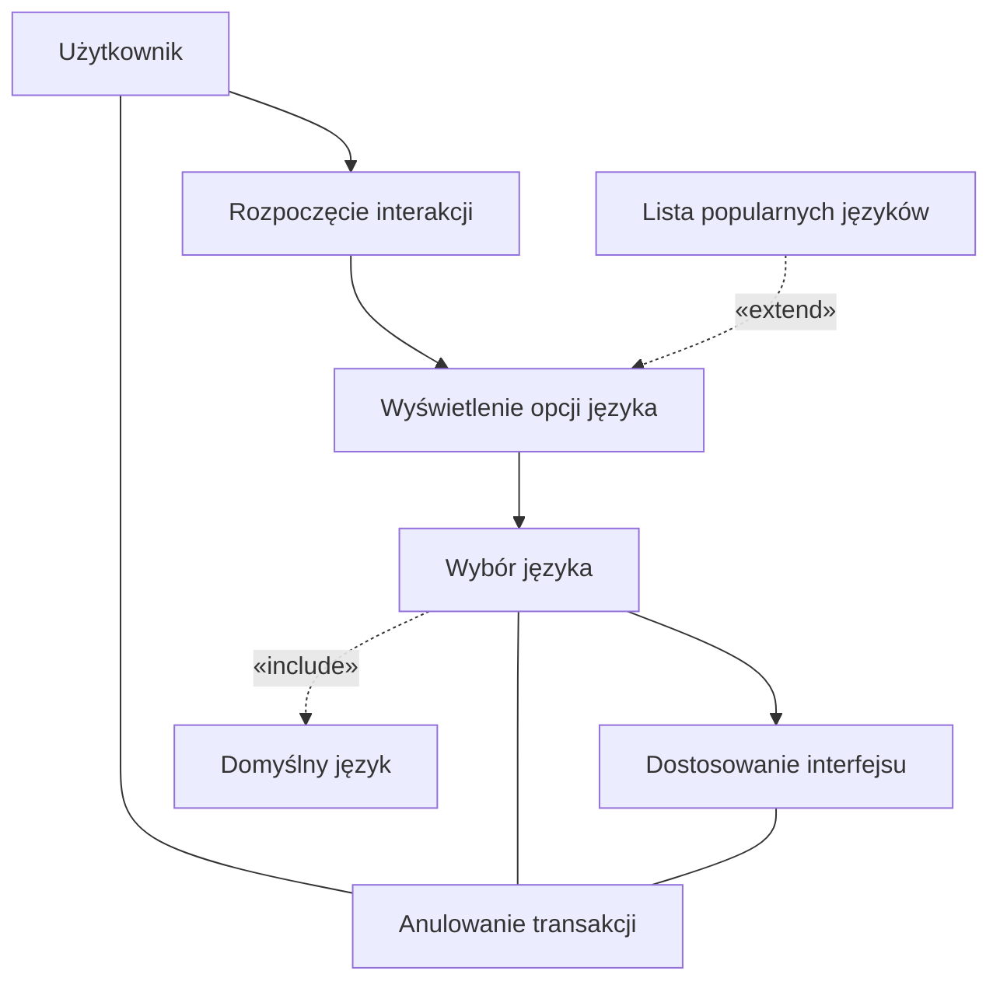
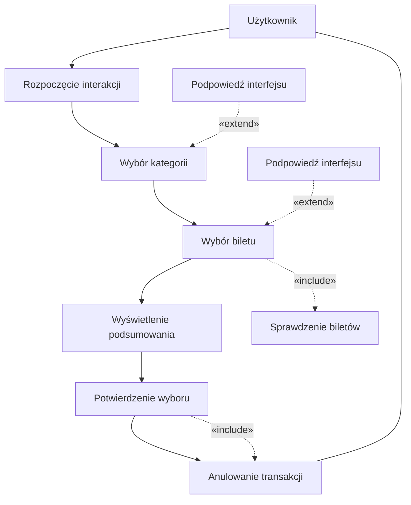
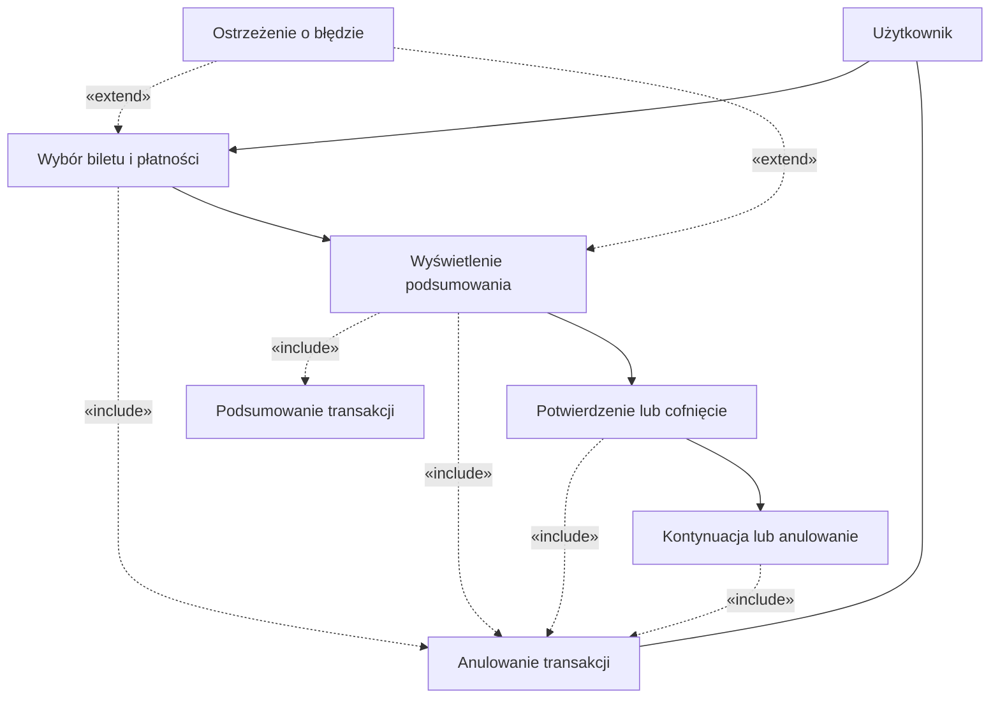

## Historie
1. Jako użytkownik, chcę szybko wybrać rodzaj biletu, aby zminimalizować czas
spędzony przy biletomacie.
2. Jako użytkownik, chcę mieć możliwość wyboru języka, aby móc korzystać z
biletomatu bez względu na znajomość języka lokalnego.
3. Jako użytkownik, chcę sprawdzić poprawność transakcji przed jej finalizacją,
aby uniknąć pomyłek.
4. Jako użytkownik, chcę otrzymać potwierdzenie zakupu (np. wydruk biletu lub
elektroniczny bilet), aby móc korzystać z transportu zgodnie z przepisami
5. Jako użytkownik, chcę płacić za bilet kartą, gotówką lub telefonem, aby mieć
większą elastyczność w wyborze metody płatności.
6. Jako użytkownik, chcę otrzymać wyraźne instrukcje na ekranie, aby wiedzieć,
jak dokonać zakupu krok po kroku.
7. Jako użytkownik, chcę widzieć czas pozostały na decyzję (np. wyświetlany
licznik czasu), aby móc szybko podjąć działanie.

## Diagramy przypadków użycia 
### Wybór języka



### Szybki wybór rodzaju biletu


### SPRAWDZENIE POPRAWNOŚCI TRANSAKCJI


### Otrzymanie potwierdzenia zakupu
```mermaid
flowchart TD
    U[Użytkownik]
    S[Biletomat]

    
    S --> A[Generowanie potwierdzenia]
    A --> B[Odebranie potwierdzenia]
    B --> C[Komunikat o zakończeniu]


    A -.->|«include»| GT[Generowanie biletu]
    B -.->|«include»| CANCEL[Anulowanie transakcji]

   
    WF[Wybór formy potwierdzenia]
    WF -.->|«extend»| A

    
    U --- CANCEL
 ```

## Diagramy sekwencji 

### Sprawdzenie poprawności transakcji


```mermaid
sequenceDiagram
    participant USER as Użytkownik
    participant UI as Interfejs
    participant SYSTEM as System
    participant DB as Baza Danych

    USER->>UI: Wybór biletu i metody płatności
    UI->>SYSTEM: Przesłanie danych transakcji
    SYSTEM->>DB: Weryfikacja danych transakcji
    alt Dane poprawne
        DB-->>SYSTEM: Wynik pozytywny
        SYSTEM-->>UI: Wyświetlenie podsumowania transakcji
        UI-->>USER: Podsumowanie transakcji
        USER->>UI: Potwierdzenie transakcji
        UI->>SYSTEM: Finalizacja transakcji
        SYSTEM-->>UI: Potwierdzenie sukcesu
        UI-->>USER: Informacja o sukcesie
    else Dane błędne
        DB-->>SYSTEM: Wykryto nieprawidłowe dane
        SYSTEM-->>UI: Ostrzeżenie o błędzie
        UI-->>USER: Informacja o błędnych danych
    end
    opt Anulowanie przez użytkownika
        USER->>UI: Anulowanie transakcji
        UI->>SYSTEM: Anulowanie procesu
        SYSTEM-->>UI: Potwierdzenie anulowania
        UI-->>USER: Transakcja anulowana
    end

```
