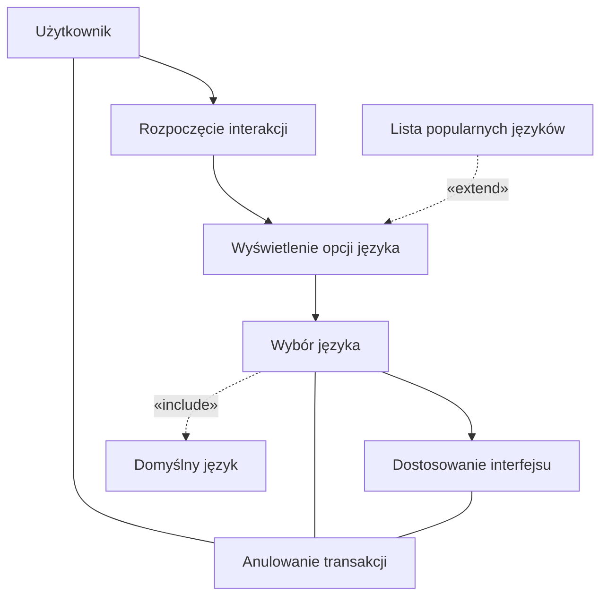
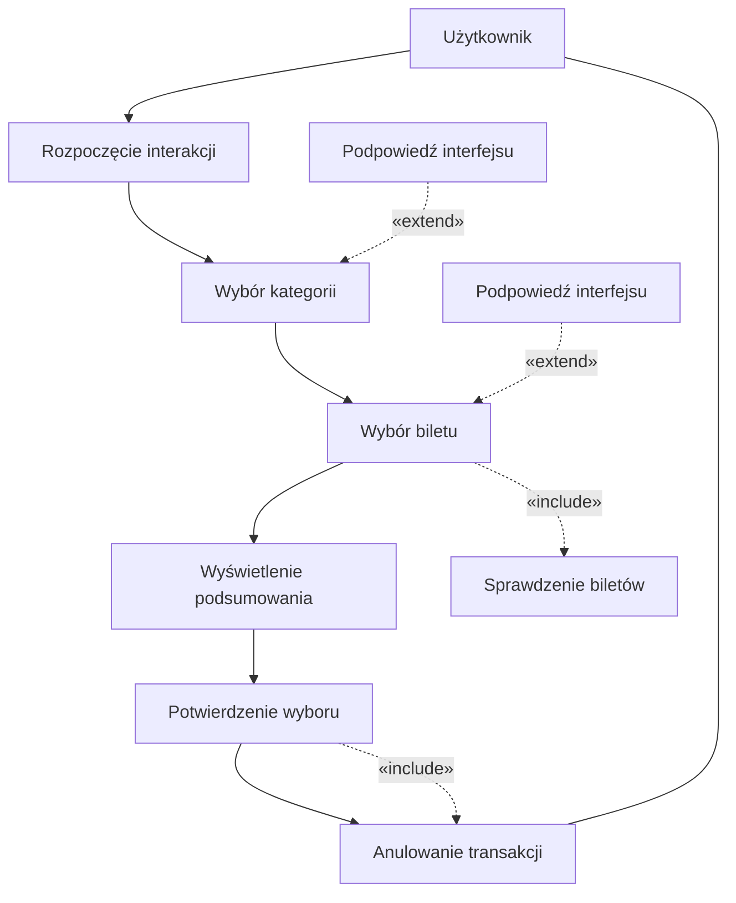
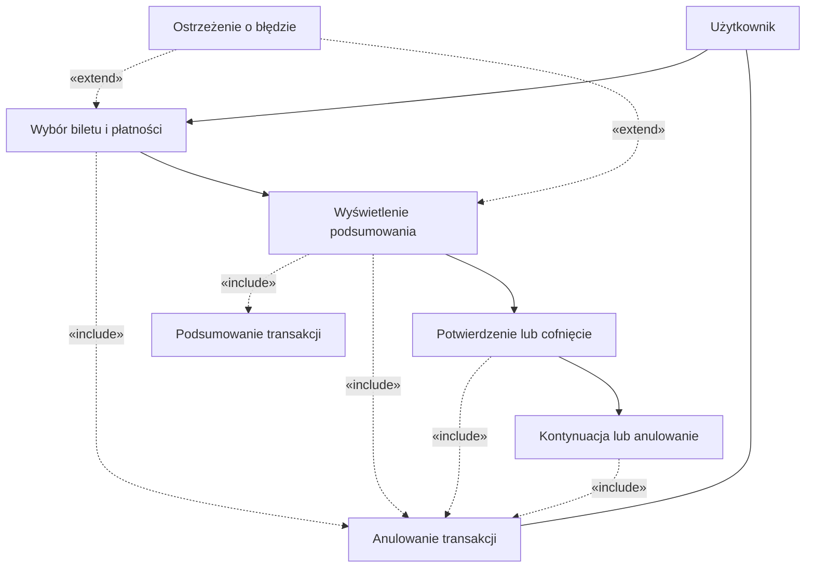

## Historie
1. Jako użytkownik, chcę szybko wybrać rodzaj biletu, aby zminimalizować czas
spędzony przy biletomacie.
2. Jako użytkownik, chcę mieć możliwość wyboru języka, aby móc korzystać z
biletomatu bez względu na znajomość języka lokalnego.
3. Jako użytkownik, chcę sprawdzić poprawność transakcji przed jej finalizacją,
aby uniknąć pomyłek.
4. Jako użytkownik, chcę otrzymać potwierdzenie zakupu (np. wydruk biletu lub
elektroniczny bilet), aby móc korzystać z transportu zgodnie z przepisami
5. Jako użytkownik, chcę płacić za bilet kartą, gotówką lub telefonem, aby mieć
większą elastyczność w wyborze metody płatności.
6. Jako użytkownik, chcę otrzymać wyraźne instrukcje na ekranie, aby wiedzieć,
jak dokonać zakupu krok po kroku.
7. Jako użytkownik, chcę widzieć czas pozostały na decyzję (np. wyświetlany
licznik czasu), aby móc szybko podjąć działanie.

## Diagramy przypadków użycia 
### Wybór języka



### Szybki wybór rodzaju biletu


### SPRAWDZENIE POPRAWNOŚCI TRANSAKCJI


### Otrzymanie potwierdzenia zakupu
```mermaid
flowchart TD
    U[Użytkownik]
    S[Biletomat]

    
    S --> A[Generowanie potwierdzenia]
    A --> B[Odebranie potwierdzenia]
    B --> C[Komunikat o zakończeniu]


    A -.->|«include»| GT[Generowanie biletu]
    B -.->|«include»| CANCEL[Anulowanie transakcji]

   
    WF[Wybór formy potwierdzenia]
    WF -.->|«extend»| A

    
    U --- CANCEL
 ```

## Diagram sekwencyj
### Wybór języka

#### Scenariusz Główny

Cel: Użytkownik dokonuje wyboru języka, a system (Biletomat) dostosowuje interfejs do wybranej opcji.

Kroki:

- Rozpoczęcie interakcji:
    - Użytkownik zbliża się do biletomatu i inicjuje interakcję, np. naciskając przycisk „Start” lub dotykając ekranu.
    - Biletomat reaguje, wyświetlając główny ekran z opcjami – w tym także wyświetleniem dostępnych języków.

- Wyświetlenie opcji języka:
    - Biletomat prezentuje listę opcji językowych na ekranie.
    - W tle system może ustawić domyślny język (casus include), jeżeli użytkownik nie wyrazi innej preferencji.

- Wybór języka przez użytkownika:
    - Użytkownik wybiera preferowany język, dotykając odpowiedniej ikony lub nazwy języka.
    - Biletomat przetwarza wybór i dostosowuje interfejs do wybranego języka.
    - System może wykonać operację include „Domyślny język”, jeśli nie zostanie wybrana inna opcja (np. przy braku aktywności przez określony czas).

- Potwierdzenie dostosowania interfejsu:
    - Biletomat wyświetla komunikat potwierdzający, że interfejs został przestawiony na wybrany język.

- Koniec interakcji:
    - Proces wyboru języka zostaje zakończony, a użytkownik kontynuuje dalsze działania (np. wybór biletu).

#### Scenariusz Alternatywny

Cel: Użytkownik może skorzystać z dodatkowego scenariusza rozszerzonego, aby poznać listę popularnych języków, lub anulować cały proces wyboru języka.

Kroki:
- Alternatywa – Rozszerzenie opcji językowych:
    - Po wyświetleniu opcji języka (krok 2 scenariusza głównego), użytkownik decyduje się na uzyskanie dodatkowych informacji o popularnych językach.
    - Użytkownik wysyła żądanie (np. naciska przycisk lub wybiera opcję "Inne opcje" bądź "Popularne języki").
    - Biletomat reaguje, wyświetlając rozszerzony widok – listę popularnych języków. To rozszerzenie wynika z relacji extend („Lista popularnych języków”).
    - Użytkownik może wybrać jeden z języków z rozszerzonej listy. Po wyborze system przechodzi do kroku 3 scenariusza głównego, czyli realizuje wybór oraz dostosowuje interfejs.

- Alternatywa – Anulowanie wyboru języka:
    - W dowolnym momencie trwania interakcji (zarówno podczas głównego wyboru, jak i przy rozszerzonej liście) użytkownik decyduje się anulować proces.
    - Użytkownik wysyła sygnał anulowania (np. naciskając przycisk "Anuluj").
    - Biletomat potwierdza anulowanie, informując użytkownika o przerwaniu procesu wyboru języka.
    - Proces zostaje przerwany, a ekran może powrócić do ekranu powitalnego lub zostaje wyłączony tryb interakcji.

        
```mermaid
sequenceDiagram
    autonumber
    participant U as Użytkownik
    participant BT as Biletomat

    %% Użytkownik inicjuje interakcję – wybór języka
    U->>BT: Rozpoczęcie interakcji
    BT-->>U: Wyświetlenie opcji języka

    %% Użytkownik dokonuje wyboru języka
    U->>BT: Wybór języka
    BT-->>U: Dostosowanie interfejsu do wybranego języka

    %% Relacja include: ustawienie domyślnego języka, jeżeli nie wybrano innej opcji
    BT-->>U: (Include: Domyślny język)

    %% Relacja extend: użytkownik może poprosić o alternatywne opcje
    U->>BT: Żądanie listy popularnych języków
    BT-->>U: (Extend: Wyświetlenie listy popularnych języków)

    %% Użytkownik ma możliwość anulowania procesu w dowolnym momencie
    U->>BT: Anulowanie transakcji
    BT-->>U: Potwierdzenie anulowania
```
